# PRINTME!

LAN-hosted photo &amp; document printing shop system with automated photo processing. A customer-facing upload portal plus a staff admin dashboard for a walk-in print shop: photo prints (fixed sizes — 1×1, 2×2, Passport, Visa, Wallet, 4×6, 5×7, 4×4) go through automatic face detection, cropping, and background removal, then get packed onto the fewest A4 sheets by the built-in layout engine; documents (PDF/DOCX/JPG/PNG) print close to as-is. Runs entirely offline on a single Windows PC — see `CLAUDE.md` for the full spec.

> **Status:** deployed and in active use at a small walk-in print shop. Staff are still adjusting workflow around it, but it's already cut a photo print job from roughly 15–30 minutes down to 5–7, and turned document printing — previously 7–8 minutes of manual file-sharing back and forth — into 1–2 minutes.

## What's built

Screenshots below are from the dev build (mock print backend, sample data) — the shop's daily code and job list will obviously differ.

### Customer upload portal

Service picker (photo/document) with price hints, daily-code gate, fixed photo sizes with live crop preview and two-finger pinch-to-zoom, PDF page-count/thumbnail preview with a swipeable multi-page viewer, ticket number + queue position on confirmation, and a status endpoint the confirmation page polls.

<p>
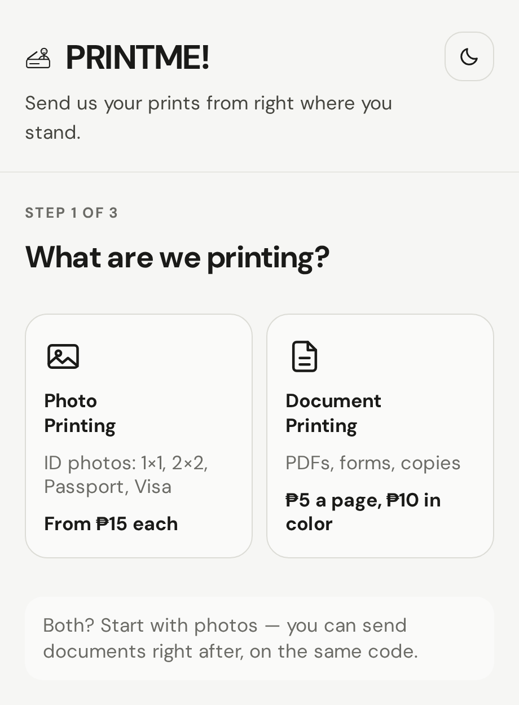
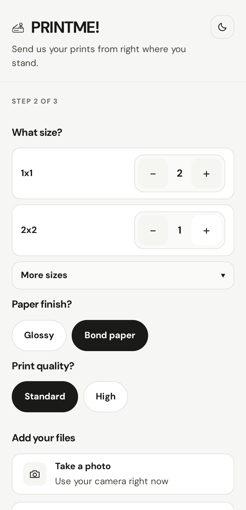
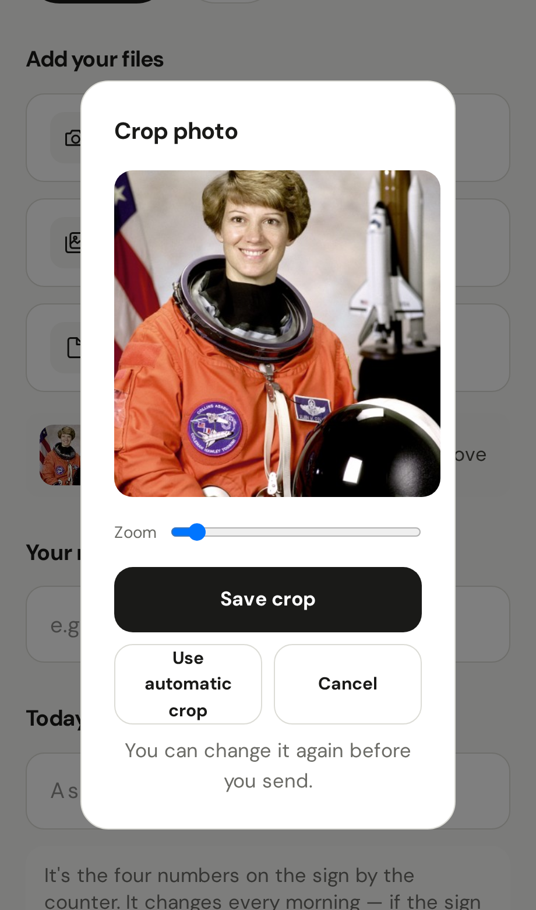
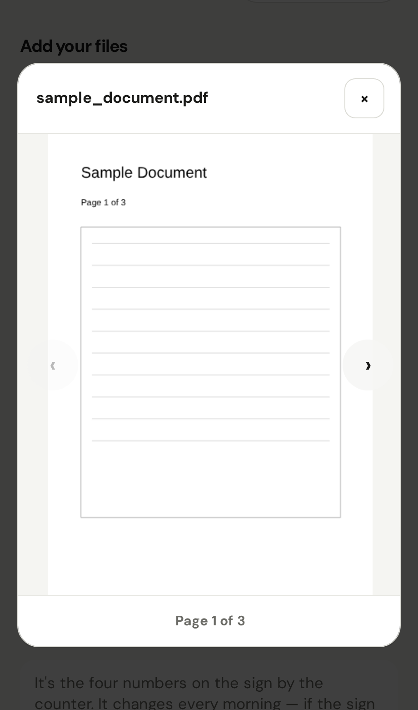
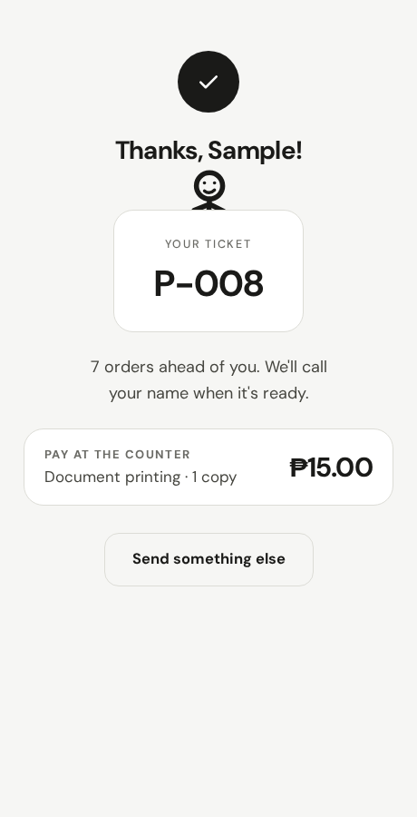
</p>

### Admin dashboard

The daily secret code (with usage count, last-reset time, and a printable counter sign carrying both the upload QR and a WiFi-join QR), per-job cards with a real-time job list, a flagged "Needs Attention" queue with the specific flag reason, per-job recrop/erase(snip)/use-original/send-back actions, and target-printer selection before printing.

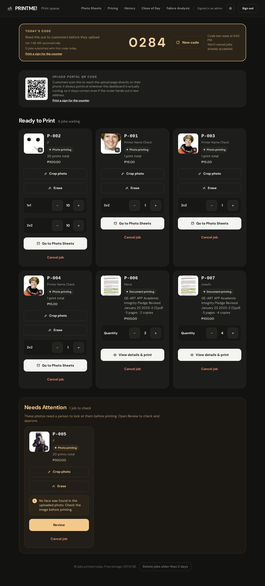

A flagged job shows the specific reason (here, no face detected) with a side-by-side before/after and a snip tool, never a silent auto-approve:

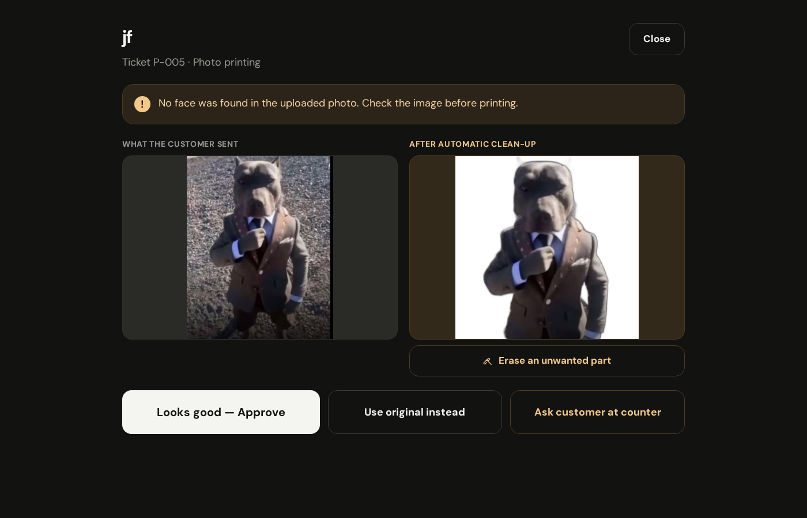

Printing a document goes through one dialog covering page range, target printer, copies, color, paper size, orientation, margins, and quality:

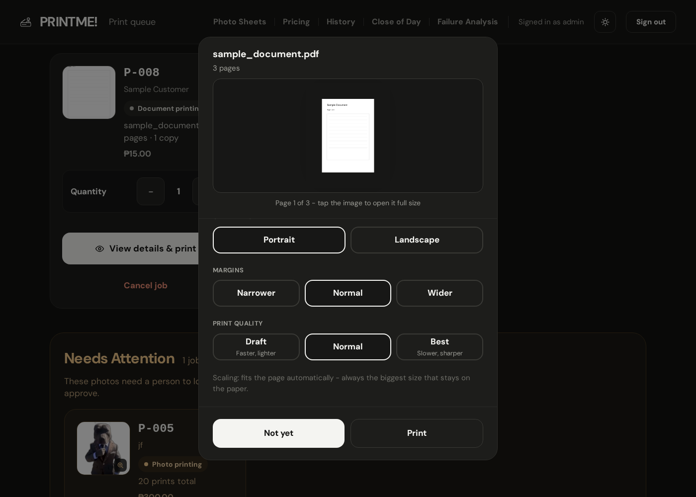

### Photo Sheets

The packed-sheet preview (grid lines/margins) per pending job, batched by paper type, with a print button and an erase tool per sheet.

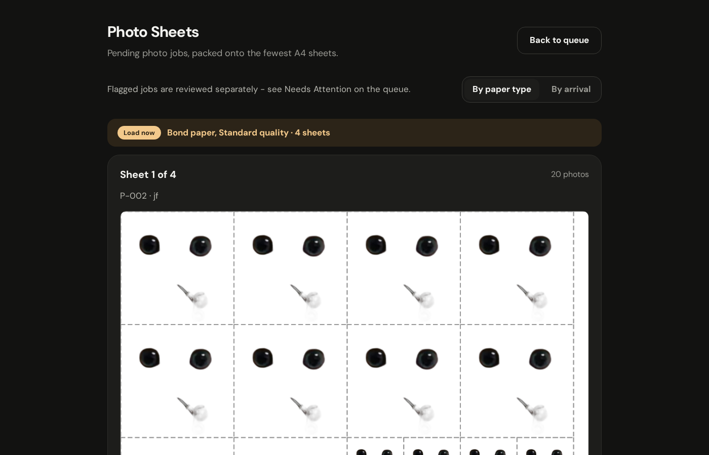

### Pricing

Editable per-size and per-page rates, plus enabling/disabling individual services and photo sizes.

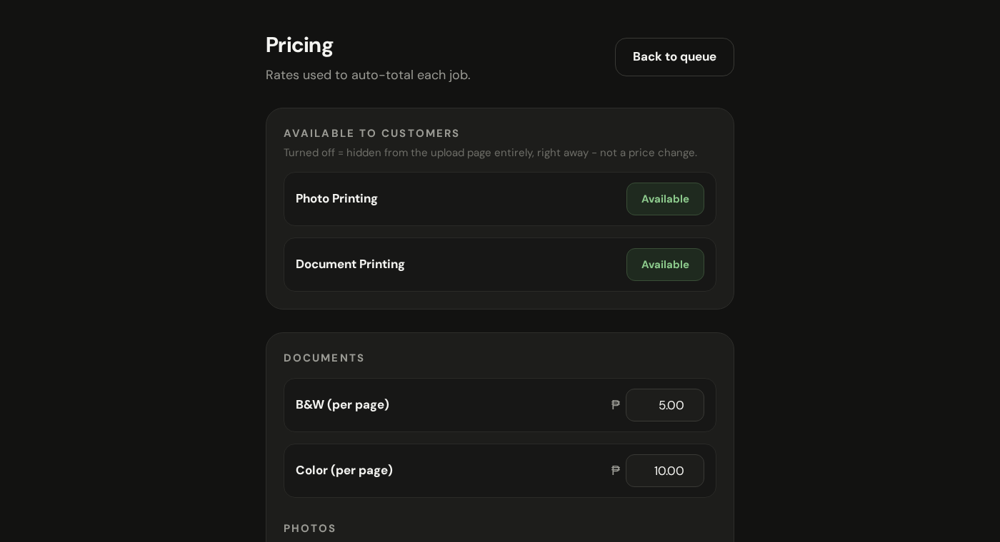

### Close of Day

Revenue, paper-type breakdown, and a never-collected-jobs backlog.

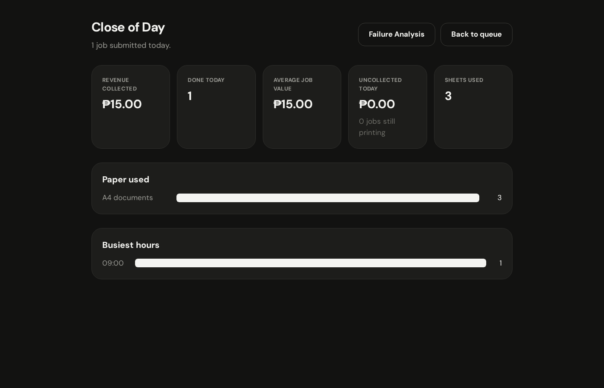

### Failure Analysis

Ranks reprint reasons over the last 30 days with a specific top-reason callout.

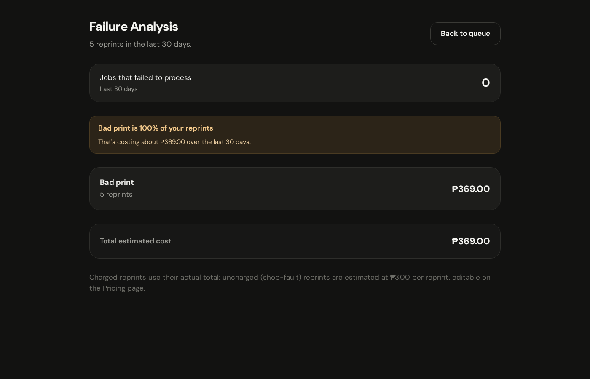

### History

Completed/failed/cancelled jobs, with restore and reprint (linked back to the original job) actions.

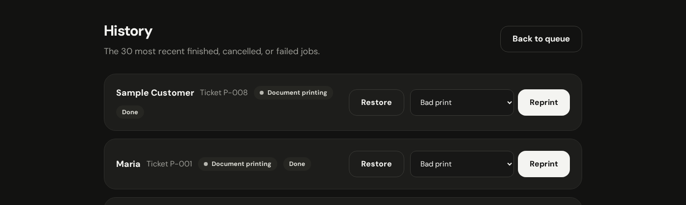

### Counter signs

Printable signs for the counter: the daily code (staff read it aloud) and, separately, the upload QR paired with a WiFi-join QR so customers can get online and start uploading from one sign.

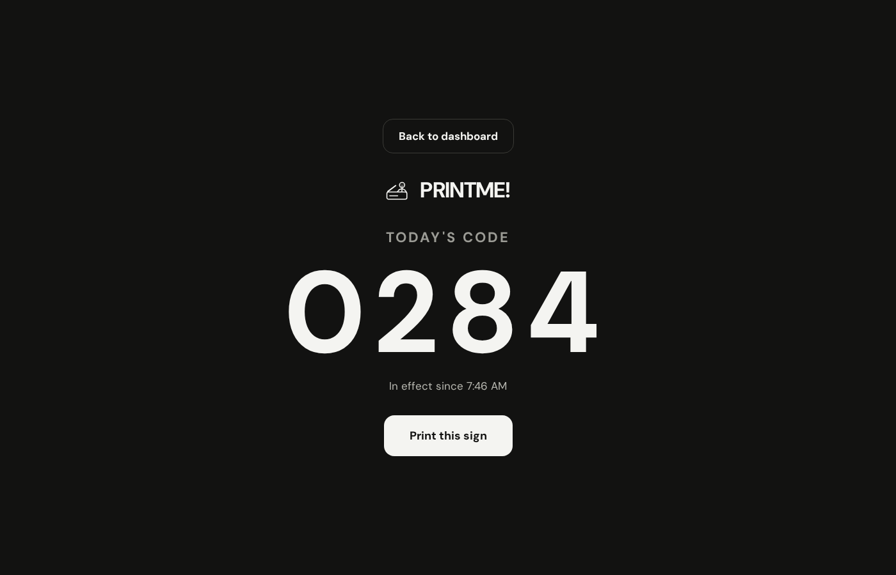
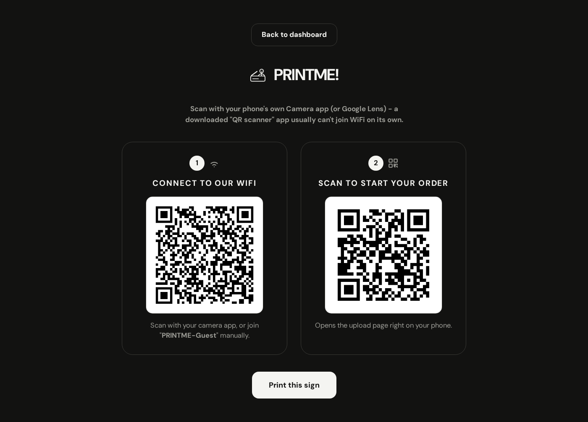

### Networking

`SERVE_HOST` locks the production server to the dedicated customer router's IP instead of every interface; the desktop shortcut and printable signs follow whatever host they're loaded from.

## Setup

1. **Create a virtual environment and install dependencies**
   ```
   python -m venv venv
   venv\Scripts\pip install -r requirements.txt
   ```
   Or run `setup.ps1`, which does this step plus installs LibreOffice
   (needed for DOCX printing - CLAUDE.md's "LibreOffice headless or
   equivalent") silently in one go.

2. **Apply the database schema**
   ```
   set FLASK_APP=wsgi.py
   venv\Scripts\python -m flask db upgrade
   ```

3. **Pre-cache the background-removal model** (one-time, needs internet — the app never reaches out again afterward)
   ```
   venv\Scripts\python -c "from printme.services.background_removal import _get_session; _get_session()"
   ```

4. **Build the CSS** (one-time, and again after editing `printme/static/src/input.css` or adding new template classes) — download the [Tailwind standalone CLI](https://github.com/tailwindlabs/tailwindcss/releases) as `tailwindcss.exe` in the repo root, then:
   ```
   powershell -File scripts\build_css.ps1
   ```

5. **Run it**
   ```
   venv\Scripts\python run.py
   ```
   Visit `http://127.0.0.1:5000/` for the customer upload portal, `http://127.0.0.1:5000/admin/login` for the staff dashboard (demo password: `print`, set `ADMIN_PASSWORD` for anything real).

## Admin PC setup (production, do this once)

For the actual shop PC — not the dev workflow above. After completing
steps 1-4 above (venv, dependencies, the background-removal model cache,
and the built CSS), run:

```
powershell -File scripts\install_startup_task.ps1
```

This registers a Scheduled Task that starts PRINTME! silently every time
this Windows account logs in, and adds a "PRINTME Dashboard" icon to the
Desktop that opens the admin dashboard like any other app — no terminal,
no `pip install`, no `flask db upgrade`, ever again. Every future update
to this repo just needs the new files copied in and the PC restarted (or
sign out/in) — `wsgi.py` runs the equivalent of `flask db upgrade` itself
on every launch, so the schema always catches up on its own.

Two things worth knowing:
- The task starts **at log on**, not before. If the counter PC should be
  ready before anyone touches it, configure Windows for auto-logon
  (Settings → Accounts → Sign-in options) — that's a Windows setting, not
  something the install script does for you (it would otherwise need this
  account's password stored in Task Scheduler).
- If the dashboard ever doesn't load, check `instance\printme.log` first —
  both a failed migration and a failed server start (e.g. the port
  already in use) are logged there, since there's no visible console to
  read them from otherwise.

### Letting customer phones actually reach it

Also from an elevated ("Run as administrator") PowerShell prompt, once:

```
.\scripts\allow_firewall_port.ps1
```

Windows blocks inbound connections by default — without this, the server
can be running perfectly and phones on the same network still won't be
able to load the page.

Optionally, set `SERVE_HOST` in `.env` to the admin PC's reserved IP on
that network (see below) before the first production launch — this locks
the server to that interface only, so nothing reachable from the shop's
main WiFi, a VPN, or a WSL/virtual adapter can reach the print queue.
Leave it unset (defaults to every interface) if there's no separate
network to lock it to.

If PRINTME! is meant to run on its own dedicated router (separate from
whatever else the shop's main WiFi is used for) rather than sharing the
main network, a few things have to actually be true on that router, not
just on this PC:
- **No MAC address filter limiting it to the admin PC** — that would block
  every customer phone from joining at all. Either remove the filter or
  add every device you expect, which isn't practical for walk-in
  customers — remove it.
- **WiFi turned on** with a customer-facing name/password. AP (client)
  isolation is fine to leave on — it stops phones from seeing each other,
  not from reaching the admin PC.
- **A DHCP reservation for the admin PC** on that router, so its LAN IP
  never changes. The dashboard's QR code already regenerates itself from
  whatever address it's loaded at (it doesn't need this), but a **printed**
  copy taped to the counter does — it only stays correct if the IP behind
  it never changes.
- When printing that QR code or writing down the address by hand, do it
  from a browser connected to the **same network customers will use** —
  not `127.0.0.1`, not the main WiFi's IP if that's a different network —
  since it encodes whatever address reached it.

## Tests

```
venv\Scripts\python -m pytest
```
